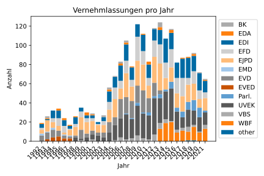
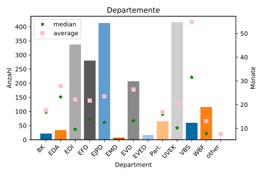

# Vernehmlassungen scraping and analysing
## Purpose
This project tries to find the answer how long it takes for a motion to come into effect in a law. The process is outlined in an official article on [ch.ch](https://www.ch.ch/de/politisches-system/volkerrecht/wie-entsteht-ein-gesetz/).

## Data acquisition
The first sign of a motion to make a law I found was the *Vernehmlassung*, the process of researching possible effects of the law and discussion with different stakeholders. These *Vernehmlassungen* are listed on the [official website of the Swiss Law](https://www.fedlex.admin.ch/de/consultation-procedures).

There is no direct link or reference between a *Vernehmlassung* and a new law, so an approximation had to be made. Many (newer) *Vernehmlassungen* list the laws they may change. So, the most optimistic value was chosen, being the earliest listed change date, where the vote and change date are after the end of the *Vernehmlassung*. If there are multiple laws listed, the mode of the accept date was considered and the average of the vote date with the selected mode was used.

This approximation is too optimistic in assuming that each *Vernehmlassung* was discussed as soon as possible and more importantly the adjacent change in law was also accepted. On the other hand, even if that particular change in law was rejected, the *Vernehmlassung* was still read and used for the following processes and laws.
## Downloads
There are two datasets (scraped on 22.11.2021) to download:
- [*vernehmlassungen.csv*](https://raw.githubusercontent.com/rostro36/Vernehmlassungen/master/vernehmlassungen.csv) &rightarrow; only Vernehmlassungen
	- Title of Vernehmlassung
	- Text of Vernehmlassung (if available)
	- Deadline of Vernehmlassung
	- Department of Vernehmlassung
	- Body to perform the Vernehmlassung (*Behoerde*)
	- Laws linked to Vernehmlassung (if available)
- [*laws.csv*](https://raw.githubusercontent.com/rostro36/Vernehmlassungen/master/laws.csv) &rightarrow; Vernehmlassungen + next possible law change
	- Title of Vernehmlassung
	- Text of Vernehmlassung (if available)
	- Deadline of Vernehmlassung
	- Department of Vernehmlassung
	- Body to perform the Vernehmlassung (*Behoerde*)
	- Laws linked to Vernehmlassung (if available)
	- **Decision date** &rightarrow; date when a council decided on a new law
	- **Accept date** &rightarrow; date when the law is officially active
## Plots
In the folder [plots](./plots) there are many plots contained which visualize some of the key features and can be used to answer some important questions.

**Vernehmlassungen per year**



**Vernehmlassungen per department and avg/median time to law**


## Prediction results
The easy baseline task of predicting the time from the Vernehmlassung deadline to the decision date with both dates present was solved quite well. This part of the data seems to be good and the (SVM-)model also works as expected.

The first knockback was seeing that the task is too hard with only the non-textual features and results were only slightly better than really bad (probably maximum likelihood) scores from badly fitted neural networks.

The second knockback was seeing that adding textual information hardly made the scores any better, if it made them better at all.

In both tasks there was not much effort put, as I expect with only this comparatively small amount of data, there is not much I can do for the very hard task of finding the duration until a Vernehmlassung is discussed.

One problem of this task is that the arguably most important knowledge, the current political climate of the Vernehmlassung, is hard to put into features. Also, I could not find a pre-trained German BERT, that is focussed on law and politics, which should help with the small differences between different Vernehmlassungen.

This does not mean that this dataset is completely uninteresting; the statistics in the plot are still interesting and maybe there are easier questions, such as classifying the department given the text of a Vernehmlassung.
## How to run
### Scraping
```
cd your/personal/directory/Vernehmlassungen
pipenv install
pipenv shell
python3 main.py
```
### Plotting
Open [Plotting.ipynb](./Plotting.ipynb).
### Predictions
Open [Predictions.ipynb](./Predictions.ipynb) e.g. with [Google Colaboratory](https://research.google.com/colaboratory/) to get GPU support.

## ToDo
- Test requirements.txt
